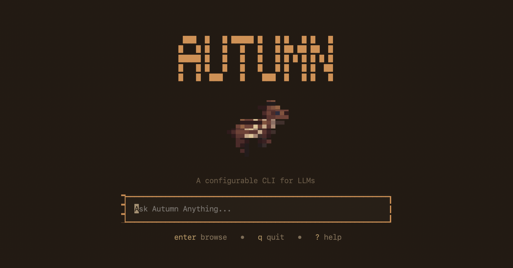

# autumn



`autumn` is a terminal command center for [GEPA](https://github.com/gepa-ai/gepa) prompt-optimization runs and model-backed agent workflows. It gives you a live Textual dashboard for runs, a persistent chat surface, local and hosted model routing, first-run model setup, provider key management, and lightweight subagents without leaving your terminal.

Inspired by [Torlink](https://github.com/baairon/torlink) and built with [Textual](https://textual.textualize.io/).

## Highlights

- **Live GEPA dashboard** - watch optimization runs in real time with Overview, Candidates, Log, Chat, Models, and Settings tabs.
- **Historical run browser** - browse past runs from Autumn's run registry, with status, best score, candidate count, and log/candidate detail.
- **One shared chat** - ask questions from the landing screen or dashboard command bar; the transcript is persisted and can be resumed after relaunch.
- **Local and hosted model routing** - route prompts through local `llama.cpp` models, Groq, Anthropic, OpenAI, or the built-in `autumn/offline-tiny` fallback.
- **First-run model picker** - choose from curated small GGUF models and let Autumn download them in the background while you enter the dashboard.
- **Unified model catalog** - manage installed local models, provider-backed models, one default selection, and fallback behavior from the Models tab.
- **Streaming replies and cancellation** - Groq and local `llama.cpp` replies stream into chat; press `escape` to stop an in-flight generation while keeping partial output.
- **Chat tools for project state and web search** - Groq-routed chat can search Autumn's own docs, search the web through Tavily, list models, list configured providers, and list runs.
- **Configurable system actions** - chat can install curated models, set defaults, and add/remove keys after explicit confirmation, or immediately when `action-mode` is set to `autonomous`.
- **Subagents** - run one-shot subagents from the CLI or dashboard chat, with named participants, queueing, fallback warnings, and cancellation.

## Install

For development:

```bash
pip install -e .
```

The published package name is `autumn-cli`, because `autumn` was already taken on PyPI. The installed console command is still:

```bash
autumn
```

## Quick Start

Launch Autumn:

```bash
autumn
```

On a fresh install, Autumn offers a curated local model picker. Pick one or more models to download from Hugging Face, or skip and use hosted providers/offline fallback. Downloads continue in the background and show progress in the command bar.

Press Enter on an empty landing input to browse previous runs. Type `gepa run ...` to launch a script run, `gepa optimize ...` to draft a prompt optimization, or anything else to start a chat.

```bash
gepa run fixtures/examples/priority_triage.py --dry-run
```

Optimize a prompt without writing a GEPA script:

```text
gepa optimize --prompt "Classify this support ticket by priority." --model tiny --eval tiny-smoke@2026.07.12 --metric exact_match --name ticket-priority
```

Inside the dashboard, press `:` to focus the command bar.

## GEPA Runs

Run a script directly:

```bash
autumn run fixtures/examples/priority_triage.py
```

Preview the dashboard without executing the script:

```bash
autumn run fixtures/examples/priority_triage.py --dry-run
```

Run every direct child Python script in a directory:

```bash
autumn run --run-dir fixtures/examples
```

List known runs without opening the TUI:

```bash
autumn runs
autumn runs --json
```

Autumn monkeypatches `gepa.optimize` and `gepa.optimize_anything`, runs your script via `runpy`, and streams real `GEPACallback` events into the dashboard. Script runs are explicit: `gepa run <script.py>` is accepted in the TUI, while bare `gepa <script.py>` is rejected with guidance to choose `gepa run` or `gepa optimize`.

Runs are stored under `$XDG_DATA_HOME/autumn/runs`, falling back to `~/.local/share/autumn/runs`.

## Prompt Optimization

Use `gepa optimize` when you have a prompt and want Autumn to run GEPA against an installed eval asset without writing a Python launcher script. The command creates a prompt-optimization draft and opens an editable confirmation screen before anything launches.

```text
gepa optimize --prompt "Answer the customer in one concise paragraph." --system-prompt "You are a support assistant." --task-model tiny --optimizer-model openai/gpt-4.1-mini --eval tiny-smoke@2026.07.12 --metric exact_match --budget 25 --name support-replies
```

The confirmation screen lets you review and edit the prompt, optional system prompt, task model, optimizer model, eval asset, metric, run name, and metric-call budget. Required fields must be present before launch. If either selected model is hosted by Groq, Anthropic, or OpenAI, the screen shows a hosted-provider data-flow warning because prompts, eval inputs, candidate prompts, and model responses may leave your machine during the run.

You can also start the same flow conversationally with narrow GEPA-specific chat phrases:

```text
run GEPA on this prompt: Answer the customer in one concise paragraph.
use GEPA to optimize "Classify this ticket by priority."
```

Generic requests such as `optimize this`, `improve this`, or `make this better` stay in normal chat. During intake, Autumn asks targeted follow-up questions for missing fields and accepts deterministic multi-field answers such as `eval tiny-smoke@2026.07.12 metric exact_match budget 25`.

Prompt optimization runs use the same dashboard lifecycle as script runs: they queue behind active work, stream GEPA progress, populate Overview/Candidates/Log, and add a dedicated best-result surface when the run finishes. The best result includes the optimized prompt, optional system prompt, score when available, and artifact paths. Completion writes durable artifacts into the run directory:

- `autumn_prompt_optimization_spec.json` - the exact prompt optimization spec used for the run.
- `autumn_best_candidate.json` - the best candidate metadata, score, and candidate fields.
- `autumn_best_prompt.md` - a copy-friendly Markdown version of the optimized prompt.

Historical prompt optimization runs reload those artifacts so the best prompt remains available after relaunch.

## Eval Assets and Metrics

Prompt optimization uses installed eval assets. Eval assets are immutable, versioned, data-only bundles discovered from a static manifest and installed locally before runtime.

```bash
autumn evals available
autumn evals install tiny-smoke@2026.07.12
autumn evals list
autumn evals remove tiny-smoke@2026.07.12
```

`autumn evals available` shows remote manifest metadata such as label, description, supported metrics, size, license, and provenance. `autumn evals install` downloads the selected version, verifies its checksum, validates the data-only bundle, and records the installed manifest locally. Reinstalling an already-installed immutable version is refused rather than overwritten.

Eval assets declare which built-in metrics they support. Autumn currently ships:

- `exact_match` - scores exact normalized agreement with the eval answer.
- `contains` - scores whether the final response contains the eval answer.

You may also choose a custom local metric by explicit file path and function name in the confirmation screen. Custom local metrics are trusted local code, like running your own GEPA script: they are never downloaded as eval assets and are visually marked as trusted local code. Custom metric functions receive the eval example, final response, and candidate context; Autumn does not pass the full model transcript in v1.

## Dashboard

The dashboard has seven main tabs when a prompt optimization result is available, and six for ordinary script runs:

- **Overview** - run status, iteration/budget progress, and current best candidate.
- **Best Result** - prompt-optimization-only result surface with the optimized prompt, optional system prompt, score, and artifact status.
- **Candidates** - sortable candidate table with Pareto-front markers.
- **Log** - streaming event log for the selected run.
- **Chat** - shared conversation with Autumn, including model status, tool status, citations, and subagent messages.
- **Models** - grouped catalog of local and provider models, with `d` to set the highlighted model as default.
- **Settings** - shared CLI/dashboard preferences for web-search and system-action autonomy.

The sidebar lists live and historical runs. Move through it with arrows or `j`/`k`.

## Models

Autumn can use local models managed under `$XDG_DATA_HOME/autumn/models` or hosted provider models when API keys are configured.

Local model commands:

```bash
autumn models install tiny ./tiny.gguf --backend llama.cpp --context-window 2048
autumn models list
autumn models list --json
autumn models default tiny
autumn models remove tiny
```

Provider key commands:

```bash
autumn keys add groq "$GROQ_API_KEY"
autumn keys add anthropic "$ANTHROPIC_API_KEY"
autumn keys add openai "$OPENAI_API_KEY"
autumn keys add tavily "$TAVILY_API_KEY"
autumn keys list
autumn keys remove groq
```

Stored keys override environment variables. Key values are never printed by `autumn keys list` or by chat's key-listing tool.

Autumn currently knows these hosted model groups:

- **Groq** - `llama-3.3-70b-versatile`, `llama-3.1-8b-instant`, `gemma2-9b-it`
- **Anthropic** - `claude-sonnet-5`, `claude-opus-4-8`, `claude-haiku-4-5`
- **OpenAI** - `gpt-4o`, `gpt-4o-mini`, `gpt-4.1-mini`

If the selected default is unavailable, Autumn falls through the catalog and then to `autumn/offline-tiny`.

## Chat

Chat is available from the landing screen and from the dashboard command bar. It can answer directly through the active model, or, when routed through Groq, use tool calls to inspect Autumn's project, local state, and the web.

Groq-routed chat can:

- Search `docs/**/*.md`, `README.md`, and `AGENTS.md`, with source citations.
- Search the web through Tavily with `/search <question>` when a Tavily key is configured, with result URLs as citations.
- List installed local models.
- List which providers have configured keys without revealing key values.
- List known GEPA runs.
- Install curated models, set the default model, add keys, remove models, and remove keys after confirmation by default.

Destructive actions require a confirmation dialog with a short delay before the confirm button is enabled in the default `confirm` mode. Setting `action-mode` to `autonomous` lets Groq-routed chat execute system actions immediately.

Search and action autonomy are shared between the CLI and dashboard:

```bash
autumn config set search-mode explicit
autumn config set search-mode autonomous
autumn config set action-mode confirm
autumn config set action-mode autonomous
autumn config show
```

## Subagents

Run a one-shot subagent from the CLI:

```bash
autumn subagent "Summarize the latest run results"
```

Launch dashboard subagents from chat:

```text
/subagent Compare the top candidates and explain the tradeoffs
/subagent cancel Autumn Sub Agent 1
```

Dashboard subagents appear as named chat participants, run alongside normal chat, queue after four concurrent workers, and report fallback warnings when the routed model changes.

## Queueing and Resume

Autumn keeps command submission ordered:

- Submit `gepa run ...` while a run is live and it queues behind the active run.
- Submit `gepa optimize ...` while a run is live and its durable prompt-optimization spec queues behind the active run.
- Submit chat while a run is live and the prompt is recorded immediately, then answered in order.
- Submit `gepa run --run-dir <directory>` and each direct child Python script is queued in sorted order.

Pending queues and unfinished chat sessions are persisted. Queue sessions preserve typed script runs, prompt optimization specs, and chat prompts distinctly, so mixed queues can be resumed after relaunch. On relaunch, Autumn offers to resume or start fresh.

## Configuration Paths

Autumn uses XDG-style paths:

- Runs: `$XDG_DATA_HOME/autumn/runs` or `~/.local/share/autumn/runs`
- Models: `$XDG_DATA_HOME/autumn/models` or `~/.local/share/autumn/models`
- Provider keys: Autumn's credentials JSON, written with `0600` permissions
- Preferences: Autumn's config JSON, written with `0600` permissions

For `llama.cpp` models, `llama-cli` must be on `PATH`, or set:

```bash
export AUTUMN_LLAMA_CLI=/path/to/llama-cli
```

## Roadmap

The current PRDs and issues point at a few active themes:

- Continued hardening of curated model downloads.
- More capable subagent workflows and run-control tools.

See `docs/prd/` and the GitHub issue tracker for the detailed working specs.

## Release

Releases are cut manually by a maintainer with PyPI access:

```bash
python -m build
twine upload dist/*
```
